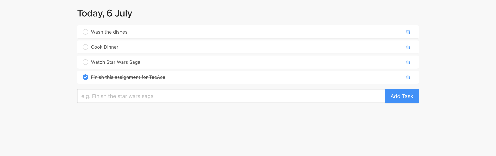

# todo-web

A simple todo list web app

## TOOLS
- [React](https://reactjs.org/)
- [axios](https://www.npmjs.com/package/axios)
- [moment](https://momentjs.com/)
- [Ant Design](https://ant.design/)
- [todo-api](https://radiant-tundra-36373.herokuapp.com/)
- [NPM](https://www.npmjs.com/)

## WHAT
A React app that provides a friendly user interface to interact with the [todo-api](https://radiant-tundra-36373.herokuapp.com/). The web app fetches, stores, updates and deletes todo items by communicating with the API. Go ahead and [try it](https://charlyecastro.github.io/todo-web/) out!

## Final Thoughts
Thanks [TecAce](https://www.tecace.com/) for giving me the oppurtunity to work on this assessment! It was a fun project and I hope you enjoy my work. Have a good day and Stay Safe! :)
